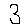

# Handwritten Digit Recognition

This project demonstrates a handwritten digit recognition system using a neural network built with TensorFlow and Keras. The model is trained on the MNIST dataset and is capable of predicting digits from images.

## Table of Contents

- [Installation](#installation)
- [Usage](#usage)
- [Project Structure](#project-structure)
- [Methodology](#methodology)
- [Examples](#examples)
- [Acknowledgements](#acknowledgements)

## Installation

### Prerequisites

Ensure you have Python 3.x installed. You can download it from [python.org](https://www.python.org/).

### Dependencies

Install the required packages using pip:

```sh
pip install tensorflow opencv-python-headless numpy matplotlib
```

## Usage

1. **Run the script:**

   ```sh
   python main.py
   ```

2. **Place your digit images in the specified directory:**

   Modify the `image_directory` variable in the script to point to your directory containing digit images named `input1.png`, `input2.png`, etc.

3. **Check the output:**

   The script will display the predicted digit and show the image using matplotlib.

## Project Structure

- `main.py`: Main script for training, saving, loading, and evaluating the handwritten digit recognition model.
- `README.md`: Project documentation.

## Methodology

### 1. Data Loading and Preprocessing

The MNIST dataset is loaded, and the images are normalized.

```python
mnist = tf.keras.datasets.mnist
(x_train, y_train), (x_test, y_test) = mnist.load_data()
x_train = tf.keras.utils.normalize(x_train, axis=1)
x_test = tf.keras.utils.normalize(x_test, axis=1)
```

### 2. Model Building

A sequential neural network model is built with two hidden layers and an output layer.

```python
model = tf.keras.models.Sequential()
model.add(tf.keras.layers.Flatten(input_shape=(28, 28)))
model.add(tf.keras.layers.Dense(128, activation='relu'))
model.add(tf.keras.layers.Dense(128, activation='relu'))
model.add(tf.keras.layers.Dense(10, activation='softmax'))
```

### 3. Model Compilation and Training

The model is compiled and trained on the training data.

```python
model.compile(optimizer='adam', loss='sparse_categorical_crossentropy', metrics=['accuracy'])
model.fit(x_train, y_train, epochs=3)
model.save('handwritten.model')
```

### 4. Model Evaluation

The trained model is evaluated on the test data.

```python
model = tf.keras.models.load_model('handwritten.model')
loss, accuracy = model.evaluate(x_test, y_test)
print(accuracy)
print(loss)
```

### 5. Prediction

The model predicts digits from images in the specified directory.

```python
image_number = 1
image_directory = r"D:\\PROJECTS\\Handwritten Digit Recognition Project\\Digits"

while os.path.isfile(os.path.join(image_directory, f"input{image_number}.png")):
    try:
        img = cv2.imread(os.path.join(image_directory, f"input{image_number}.png"))[:, :, 0]
        img = np.invert(np.array([img]))
        prediction = model.predict(img)
        print("This Digit is", np.argmax(prediction))
        plt.imshow(img[0], cmap=plt.cm.binary)
        plt.show()
    except:
        print("Error!")
    finally:
        image_number += 1
```

## Examples

**Example Input Image:**



**Example Output:**

```
This Digit is 3
```

## Acknowledgements

This project uses the TensorFlow and Keras libraries for building and training the neural network. Special thanks to the MNIST dataset creators for providing the dataset used in this project.
